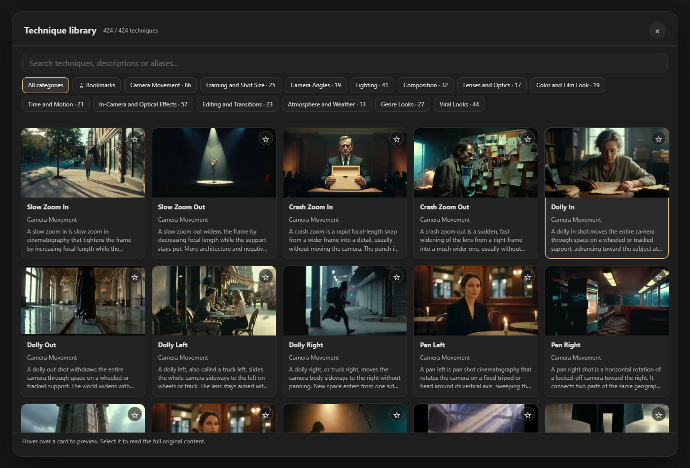
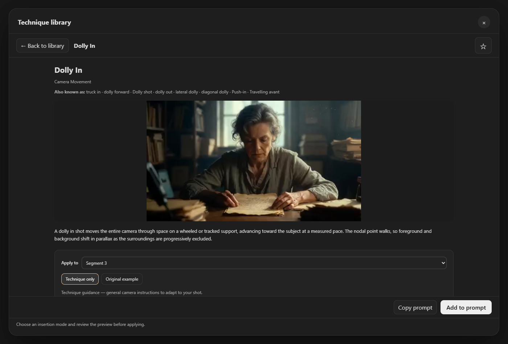
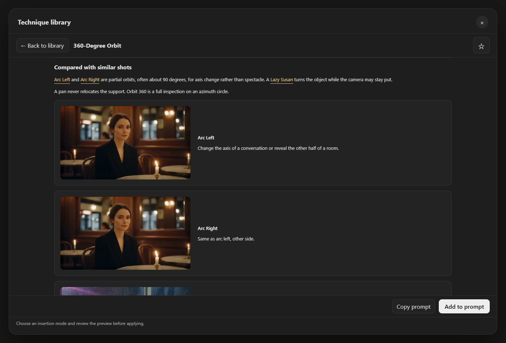
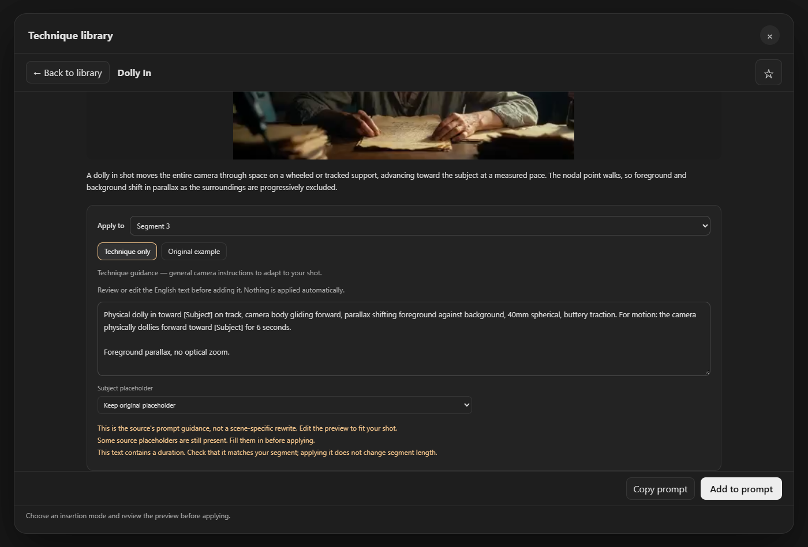

# Offline cinematic Technique library

The **Techniques** button opens a searchable cinematic-technique catalogue using
Continuity's own modal, typography, controls and colour tokens. The library is
separate from presets: applying one changes the explicitly selected prompt, not
an entire saved setup.

The screenshot uses the real catalogue and library UI in an isolated browser
fixture. It is not evidence of a completed ComfyUI/GPU render.

## Complete English catalogue

The English catalogue is complete. The contributor tested the installed UI and
reported no observed bugs during that testing. Other-language explanations remain
incomplete and will be addressed with additional usability improvements in a
follow-up.

- 424 techniques in all 13 categories; no representative/sample-only subset.
- 3,392 article sections, 424 original copy-prompt examples and 849 paragraphs
  of prompt guidance. Original English records remain intact. Explanatory text
  is displayed through separate offline Korean/Japanese/Chinese translation data;
  technique names and prompt text remain English.
- 1,264 original images and 250 videos, deduplicated by source URL and stored
  locally. 174 source entries are still-image-only; a missing video for these
  entries is not an extraction failure.
- Source URLs, SHA-256 digests and byte sizes are recorded in
  `web/creator/techniques/manifest.json`.

All browsing/preview media loads from the installed extension. Related technique
links open another detail page inside the same library, never an external website.
There are no remote scripts, trackers, accounts or API dependencies in the library.

## Using it

1. Open **Techniques** from the timeline/global prompt or segment editor.
2. Choose a category, search a title/alias/description, or filter bookmarks.
   Categories wrap instead of hiding off the right side of the window.
3. Hover/focus a video-backed card for a muted preview, or select it to read its
   article in a full-width detail view within the same modal. **Back to library**
   restores the list's filters, loaded cards, scroll position and focus. The
   detail videos autoplay muted, loop and hide playback controls. **Every video
   in this library runs at fixed 1.2x speed**, including card, comparison and
   article videos. Stills stay still; reduced-motion preferences disable automatic
   hover playback. Playback elsewhere in Continuity is unchanged.
4. Confirm **Apply to**. Every entry point lists the global prompt and all current
   segments. A segment editor defaults to its current segment; a global entry
   defaults to the global prompt. Only the selected destination receives text.
   Imported clips without a generation prompt are listed but cannot receive one.
   Deleted/replaced targets are rejected rather than applying to a stale target.
5. Select **Technique only** (the original prompt-guidance paragraphs) or
   **Original example** (the verbatim sample scene), review/edit the English
   insertion preview, then press **Copy prompt** or **Add to prompt**. Explanation
   and editing controls share one scrollable body instead of separate upper and
   lower panels. Only the compact action bar remains outside that body. Related
   techniques open internally; **Previous technique** restores the prior detail,
   while **Back to library** restores the grid. Drafts, placeholder choices and
   scroll are preserved during internal navigation.

Comparison previews, names and explanations are grouped in one card. Confirmed
poster/video pairs display once as video; image-only examples, film stills and
frame strips remain. Use the one editable preview's **Original example** mode
instead of a duplicate read-only prompt box. An explicit reset recovers the
unedited example when needed.

[User-created video example](media/technique-library-user-demo.mp4): made entirely
with the ComfyUI-Continuity node using some camera techniques from this library.
The contributor tested actual video generation and verified the resulting output.

Nothing is applied by hovering, selecting a card, or changing a filter. Existing
prompt text is retained. Original examples can contain their own characters,
locations and timing: they are not automatically adapted to your current scene.
The guidance mode substitutes only explicit subject/duration placeholders when
chosen by the user; its subject choices come from the existing cast. It does not
invent cast members or replace every mention of a person in arbitrary prose.

Applying text does not automatically change segment duration, camera settings,
references, soundscape, music, LoRA choices, cuts or continuity settings. Normal
prompt-citation behaviour still applies: explicitly adding/removing an existing
local reference handle activates/mutes that reference as ordinary typing does,
without deleting its file or removing cast members.

## Safe removal, refinement and persistence

- Applied techniques are shown as chips below their prompt. Clicking the name
  reopens its article; removing it deletes only its tracked text. Reapplying the
  same technique replaces its previously tracked insertion rather than stacking
  duplicates.
- If the user manually changes tracked text, the chip is marked as edited and
  automatic destructive replacement/removal is refused. This deliberately does
  not guess which matching sentence belongs to the library.
- Technique changes can be undone in the current editor session, provided no
  conflicting manual edits have occurred. Undo history is not persisted across
  reloads. Tracking metadata is saved in the workflow; it is excluded from the
  chained request's conditioning/cache input.
- An active Refine result replaces the written prompt during generation.
  Applying to that prompt requires explicit consent to turn off Refine while
  retaining its text. Undo can restore the prior refinement state safely.
- Older active segment refinements without `scope: "shot"` can already contain
  the global prompt. Global technique edits are blocked with guidance to disable
  or regenerate those refinements first, rather than silently applying text that
  the compiler will ignore. Scope markers are never relabelled automatically.

The library UI, category names, card descriptions and article explanations follow
ComfyUI's English/Korean/Japanese/Chinese locale. Technique names, aliases, original
prompt examples, prompt-guidance blocks and every copied/applied insertion remain
English. Explanation language follows the locale automatically; there is no
separate English-explanation switch. Explanation translations cannot become model
input accidentally. This local preview currently contains translated explanations
for five of the 424 techniques in each supported non-English locale. The other
419 show the source English with a small fallback label. Removing the old global
translation-progress notice is not a claim that all translations are finished.

Translations are prepared offline with machine assistance and targeted film-term
review; they are not claimed to be native-speaker proofread sentence by sentence.
The original records remain the authoritative source, and translation records
carry their source hash so stale explanations are not silently matched to new
articles. No translation service is contacted by the installed node.

## Validation boundary

The local test package includes catalogue/media integrity checks, state/compiler
regressions and isolated browser tests. These checks do not load ComfyUI models or
prove MiniMax H3's visual adherence to every technique. The contributor completed
local ComfyUI interaction testing, generated the node-only example above, verified
its output, and reported no observed bugs. This is not
exhaustive workflow/browser/codec coverage or a guarantee of model adherence.
The strict full-corpus explanation-localization check remains incomplete until
all 424 articles in each supported non-English locale are supplied.
