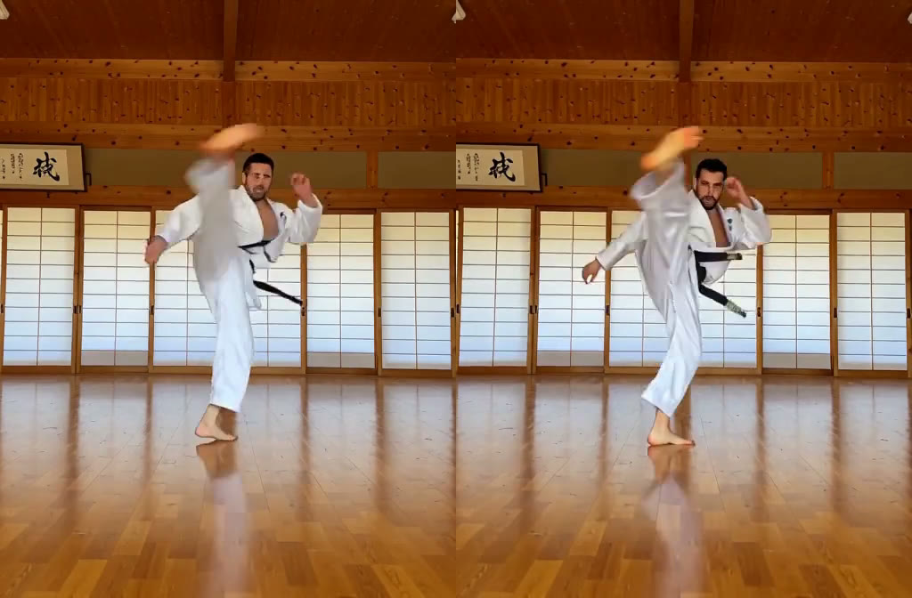
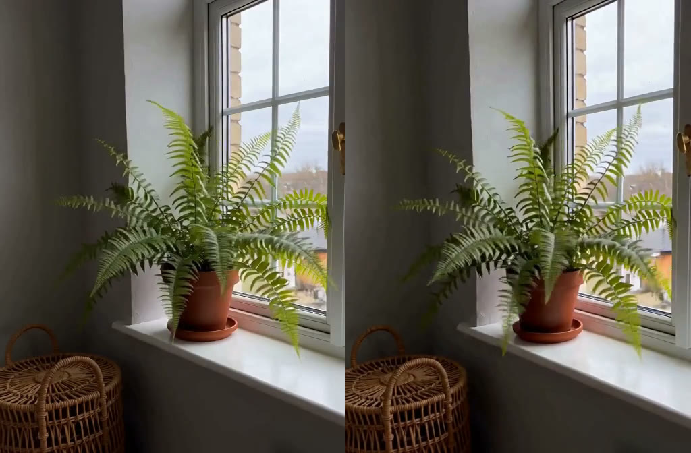

# Timelines

## Adding shots

Under the prompt there is a band labeled **Write the next shot**. Click it and
the piece has two shots, and the node's face becomes a timeline lane,
proportional to the shots' durations. Delete back down to one shot and the
single-shot face comes back. There is no mode to switch.

Each card on the strip is a whole generation with its own prompt, references,
LoRAs, and even its own family: a strip can be H3 throughout, or a pre-stage
on Krea 2 feeding start frames into shots on LTX 2.5.

## Chained vs one pass

- **Chained** (the default) renders each segment and joins them. Seams between
  segments are yours to control, below.
- **One pass** compiles the same cards into a single generation, since both
  video families take a shot list natively. No seam at all, and music or
  dialogue carries across cuts. The tradeoff: one pass means one checkpoint,
  one LoRA stack, one seed and one soundscape for the whole piece, and it can
  only hold what one context window holds. Cards that disagree about those are
  refused with a message rather than silently merged.

## Seams

In chained mode, a seam can continue from any earlier segment's last frame, at
a single frame or as a blend that carries real motion and phase-locked sound
across the cut. How wide a blend can be depends on the family. Picture and
sound cross a cut independently: a hard cut whose score keeps playing, and a
match cut that resets the room tone, are both one switch away.

## Seams and drift

Every continued shot comes out a little brighter and a little harder than
the one it continues, and the next seam starts from that, so the change
walks down a strip. Measured on an 8-hop turbo strip, about three quarters
of it arrives as a step at each cut rather than inside the shots. Three
per-machine settings on the gear's Rendering tab act on it:

- **Turbo lead-in** (on by default, four steps). A turbo LoRA collapses the
  schedule, and the opening steps are where a shot is decided. This runs
  those steps on the base weights with the LoRA held off, then hands the
  rest of the same schedule to the distilled model. Measured: the step at
  each cut falls from +2.86 with it off to about +1.0 at four steps, and
  the texture ratchet falls with it. The cost is those four steps at the
  base weights' speed. Off is the old behaviour.
- **Seam handoff**. What a blended seam hands the next shot. *The latent*
  (default) slices the run off what the sampler made, so nothing is decoded
  and encoded again on the way. *Levelled* pulls that slice back to the
  first shot's tone before the model reads it. *Masked* writes the slice
  into the next shot's own latent and holds it there while the rest is
  sampled, so the model continues the frames it made rather than
  generating new ones under guidance; measured to remove the step at the
  cut on a single sampler, and about twice as fast, but not yet measured
  together with the lead-in. *The frames* is the road every render took
  before any of these, kept for comparison.
- **Seam restore** (per seam, on the blend pill). Re-draws the frames a
  seam hands over against the source shot's own references before the next
  shot continues from them. Helps on raw H3 with a good reference, hurts on
  turbo and low step counts. Off by default.

None of this is zero yet. If you find a setting or a method that measures
better on your strips, open an issue with the per-cut numbers.

## Motion fix

H3 smears fast motion — a spinning kick, a sword arc, a whip-fast turn — into
a blur, and no seed or step count fixes it: one latent time token spans four
frames and cannot hold four different poses, so the poses were never drawn.
The **motion fix** chip on a card (H3 only, never on footage) runs a second
pass after the shot renders: the shot's own latent says where it moved too
fast, those frames are held on a longer clock at up to four copies each, the
slowed clip is sampled again from half the schedule against the shot's own
prompt and references, and the original clock is recovered by keeping the
first frame of every hold group — generated frames, never interpolated. Five
frames at either end are never held, are frozen through the second pass and
are put back verbatim, so the fix cannot become a seam step of its own; the
soundtrack rides through untouched. matlowai's Motion Lab worked the method
out; this is a reimplementation of its core.

The same frame of a 2 s turbo card at the same seed, plain on the left and
fixed on the right ([the clip](vid/motion-fix-burst.mp4)):

The kick keeps its choreography and gets its shin, foot and face back. On
this card the plan held 30 of 56 frames, slowed the clip to 124, and the
second pass cost about twice the card's own sampling time.

**The gate is the whole difference between a feature and a tax.** The same
pass over a calm shot comes back sharper and moving *wrongly* — the fern
below was re-drawn at 23 dB against the plain take and its stir no longer
reads as a draught. So a card is left alone unless its peak frame-to-frame
change, measured at thumbnail scale on 0–255, clears the gate: 4.1 on the
kick, 1.8 on the fern, gate at 2.5. The number is `motion_fix_abstain` on
the settings page; 0 fixes every card that asks, and the node writes what it
saw into the render history either way.

The same frame of a calm shot, plain on the left and forced through the
pass on the right — a still cannot show the motion going wrong, so
[the clip](vid/motion-fix-calm.mp4) is the one to watch:

Measured on two clips as of this page. A pan will clear the gate on motion
alone, and the fix has not been tried on one.

## Storyboards

A shot can be shown the shots before it. The **Storyboard** pill on the bar
has three answers: nothing, *each shot sees the shot before it*, or *each shot
sees the piece so far*. With one of the two on, every shot after the first is
handed a 3 × 3 sheet of frames from those shots — nine cells shared out by how
long each shot plays, in time order, reading left to right and top to bottom
— as its last picture reference, with a line in the prompt saying what the
sheet is, how it reads, and that the grid itself is never to be drawn. It is
the sheet people were attaching by hand (issue #43), made for you at render
time from the passes as they actually came out: a kept take is read from its
file, a cut-in clip from its window.

What it buys is the room. A cut to another angle of the same street has
nothing crossing it — no frame, no sound — and the model re-imagines the
street. With the sheet in front of it the walls, the light and where things
stand carry across. It is not a face reference: at the generation's own
canvas each cell is a ninth of the picture, enough for a place and not for a
likeness, which is what the cast is for.

The chip on every seam says what its own card sees — *sees #1–3*, *no
storyboard* — and opens to the same three answers plus a row of toggles, so
one card can see shots 1 and 4 while the piece is set to the shot before.
Under the toggles is a picture of the sheet with the number of the shot each
cell will come from, which is the one honest preview there is before the
shots exist.

Two costs. A shot shown a sheet is a reference generation, so it runs on the
reference checkpoint whatever else it carries, and the sheet takes one of the
nine picture slots — a card already citing nine is refused by name. And a
shot now depends on the shots it sees: edit shot 1 and every shot shown it
re-renders, where a hard cut used to keep its cache.

What was measured, on two scenes at three and eight shots, on turbo and on
the base weights: with the storyboard on, the place and its objects hold
across every hard cut — the same boat, crane and toolbox in all eight shots
where, without it, the same description gave a different boat in nearly
every one. The two settings hold the place equally well; *the piece so far*
is the one to reach for, because a shot's mistake then rides forward as one
cell among nine rather than as the whole sheet. On the tone drift described
above it changes nothing either way — the step at a continuation seam is the
same with it and without — and over eight hops it kept the picture's detail
where the strip without it softened.

The cost is composition. The sheet holds the camera as firmly as the room:
a shot written as a reverse angle or a close-up of the shots it sees comes
back framed like them. Some of that is the prompt's — a long standing
description ahead of a one-line shot gets framed as the description, sheet or
no sheet — but the sheet takes the rest of the variety with it. So for a shot
that needs an angle the earlier shots do not have, turn the storyboard off on
its seam chip, or show it only a shot that has that angle; the shots after it
can pick the strip back up.

Also measured and rejected: saying in the prompt that the sheet's framing is
not to be kept (no effect — the pull is in the picture), and handing the
frames over as a pooled video RefMod with the scene take instead of a sheet
(no effect on framing, and the pooled latent's colour stains compounded down
the chain). The sheet is a real picture, and that is why it stays one.

## Piece-level fields

The timeline itself carries:

- A **global prompt**: a standing description every segment inherits.
- **Piece references**: files attached to the piece rather than a card,
  addressed as `@ref-1`, `@ref-2`, and so on. Cite one in the global prompt
  and it rides into every segment; cite it in one card and it rides into that
  card alone.
- **Soundscape** and **music**: the two fields that describe the whole piece
  rather than one shot. A segment leaving them empty inherits them.
- **Global LoRAs**, merged in front of each segment's own.

## Locked takes

Every card has a padlock. Locked cards are not rendered, so you can shoot a
long strip one pass at a time, keep the takes you like, and re-shoot only the
card you are working on. Each pass is written as its own file under `takes/`.

## Cutting in your own footage

A clip you already have can be a card on the strip, not just a reference. It
has a length, a place in the order and a seam on each side, and it compiles to
no generation at all: the finished piece simply contains it. Use it for
footage the piece should include as-is.

## While it renders

The progress display shows which segment is sampling ("Segment 2 of 5"), with
a live preview. Cached segments (unchanged since the last render) are skipped
by ComfyUI's own cache, so tweaking shot 4 doesn't re-render shots 1 through 3.
