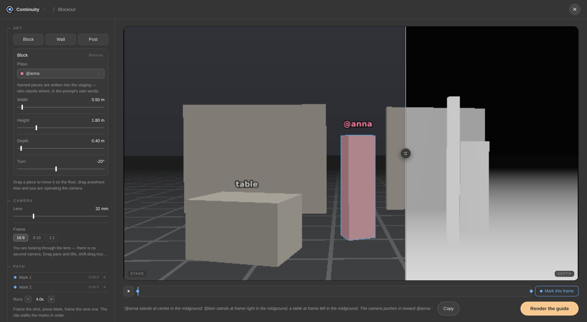
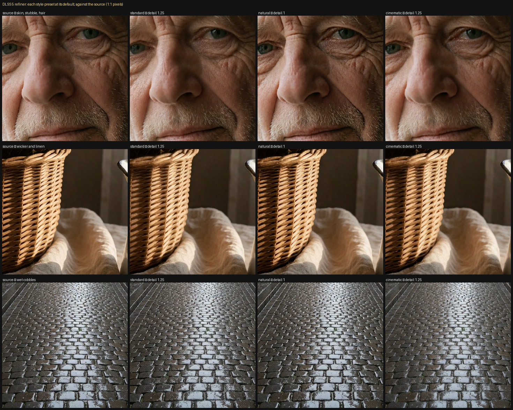

# Tools

In the fullscreen editor, press the **Continuity** wordmark at the top to open
the tools dashboard. The benches live there; the smaller tools live on the
node's rail.

**Go to** switches between the pre-stage and the shot, each opening over the
piece you already have. **Tools** opens a bench on it.

## ControlNet bench

Turns footage or a photograph you already have into a guide file a render can
follow. Drop in a clip or a picture, cut the span you want, choose a tracing,
and it writes the guide into `input/continuity/control/`. No node is added and
no workflow is touched.

The tracings:

| Tracing | What it draws | Needs |
|---|---|---|
| Edges | hard outlines (Canny) | nothing |
| Lines | a drawing that follows the form | nothing |
| Blocks | the frame flattened into fields of one colour | nothing |
| Luma | the tones with the colour taken out | nothing |
| Blur | the masses and nothing else | nothing |
| As shot | no tracing; just cuts the span or strips the soundtrack | nothing |
| Depth | a depth map (Depth Anything 3) | a model, see [models.md](models.md#the-controlnet-bench) |
| Pose | a skeleton (SDPose) | a model, see [models.md](models.md#the-controlnet-bench) |
| Matte | a white-on-black mask of a named subject (SAM 3), for video inpainting: everything outside the white stays the source clip, only the subject is regenerated. Invert it to keep the subject and replace the world. | the SAM 3 checkpoint |

The five arithmetic tracings redraw live while you drag a slider, and pressing
play traces the clip as it runs. Depth, Pose and Matte run a model per frame,
so you press **Trace** and the written file is what plays back. The preview is
one rectangle with a draggable seam: footage on the left, tracing on the
right.

**Send to pre-stage** makes the guide the still's init image; **Send to the
shot** attaches it as a reference you can cite with `@`. Neither is required;
the file is in the picker either way.

## Blockout bench

Starts from nothing at all: block a scene out of grey boxes, walk a camera
through it, and render a guide along the camera's path. No model, no download,
no queue. The renderer is arithmetic in the browser, and what is on the glass
is exactly what gets written into `input/continuity/blockout/`.

The floor opens bare. Add a **Block**, **Wall** or **Post**, or start from one
of the five arrangements in the rail (Two-shot, Corridor, Interview, Street
corner, or Bare floor), each of which brings its own camera and its own move,
so what lands on the glass is a shot rather than an assembly kit. Starting from
one replaces whatever is there.

### Two cameras

The **shot camera** is the one that gets written. It is drawn where it stands,
as a frustum in blue, with its path along the floor and a diamond at every
mark. **Free look** flies a second camera around it that touches nothing: WASD
walks, Q and E drop and rise, drag orbits, shift-drag slides, the wheel zooms,
and `F` (or a double-click) swings the view round to look at whatever is
selected. Nothing you do in free look changes the file, stales a result, or
alters a word of the prose.

**Through the lens** stands you in the shot camera, where the glass is the lens
and every gesture is a word the model was trained on: drag pans and tilts,
shift-drag trucks and pedestals, the wheel pushes in and pulls out. **Put the
camera here** moves the shot camera to where you are standing; **Go to the
camera** flies the view back to it.

Frame the shot and press **Mark**, frame the next one and mark that; the clip
walks the marks in order over a duration you set. One mark (or none) writes a
still instead. Pressing a mark's name puts the camera back on it.

### Editing the set

Click a piece to select it. Its handles hang off it on the glass. **Move**
(`1`) slides it along the world axes or, dragged by its body, across the floor;
**Turn** (`2`) gives it three rings; **Size** (`3`) three square caps. `Shift+D`
duplicates the selection, `X` removes it, and **Snap** rounds a place to 0.25 m
or a metre and a turn to 15°. The rail carries the same numbers as figures, in
the handles' own colours, and they stay in step with whatever the glass does.

The **Frame** pill carries the same aspect popover the strip does: the shape
grid over one orientation switch, off the family's own manifest, so what is on
offer is what the weights will accept. The pill says the pixels beside the
ratio, because a guide is written at that family's native canvas for the shape
you pick: what the file holds is the size the render will read it at.

### What the glass shows

**Stage** is the set as you handle it: clay, the grid with its five-metre
lines and coloured world axes, the selection ring, the handles, the camera, the
names. **Depth** (or whichever pass is selected in Output) is the frame exactly
as the file will hold it, with no staging aids on it at all.

Four outputs, three of them wearing the ControlNet bench's own names:

| Pass | What it writes |
|---|---|
| As staged | no tracing, just the clay render itself, as footage, for the families that read a plain clip or picture as a reference or an init |
| Depth | near bright, far dark, the map Depth Anything draws, taken from the geometry, so nothing is guessed |
| Blocks | each piece one flat field of colour |
| Lines | the set's edges, white on black |

The grid, the selection ring, the handles, the camera and the names are staging
aids: they live on the Stage view and never reach the written file.

A piece can be told who or what it is. **Plays** hands it to a cast member
(the block wears their chip hue on the stage side, never in the written file),
and **Called** gives a thing its word ("table", "doorway"). Named pieces are
written into the staging: the bench computes who stands where in frame from
its own projection, and the foot narrates the whole of it as you work:
*"@anna stands at centre in the midground; a table at frame left in the
foreground. The camera pushes in toward @anna at slow speed."* The camera half
is in the motion-type, amplitude and speed vocabulary the H3 prompt spec
defines. **Copy** hands you the prose to paste straight into a prompt, where
`@anna` becomes her references by the same substitution every prompt already
does. No model reads identity out of pixels. A depth map is identity-free by
construction, and even mask-injection systems bind a reference to its region
through the prompt, which is why the words are the mechanism, and why they are
generated rather than hand-written.

The finished guide goes through the same doors a tracing does, and the scene
itself is saved as a small `.json` beside the clip, including each named
piece's screen box at every mark, for conditioning schemes that can ground
against layout when one arrives.

## Upscale bench

Takes any still or clip (from this pack or not) and makes it bigger or
repairs it. Results land in `output/continuity/upscaled/`, beside your
renders, and can be attached to the shot or pre-stage from there.

Two backends:

- **Sharpen** is a GAN upscaler (anything spandrel loads) through core's own
  tiling. It resolves detail that is already in the picture and invents none:
  a face comes back the same face, and soft footage comes back soft and
  bigger, which is the honest answer for it.
- **Restore** is SeedVR2. It repairs rather than enlarges: compression
  artefacts, grain, the softness of a small frame. On a clip it reads several
  frames at once so movement doesn't boil. **Frames at a time** is the dial to
  lower if a long shot runs out of VRAM. Much slower than Sharpen, and the
  right answer for footage with something wrong with it.

The preview shows one square of the source at the size it will actually come
out, split against plain resampling, which is the comparison worth making.
**Try it here** runs the backend on that square alone, so you can dial
settings in seconds instead of re-running the whole file. On a clip, the trim
bar cuts the span first, and **This frame** takes just the frame under the
playhead as a picture.

A third entry, **Refine (DLSS 5)**, is the neural refiner below at the size
the picture already is — on the bench so the tile can be judged against the
plain source, and offered as a **Then refine** switch on Sharpen and Restore
so the material is drawn onto the enlarged picture.

Files for both backends: [models.md](models.md#the-upscale-bench).

## Image to 3D

Lifts a picture into a textured mesh you can turn in your hands, stage and
shoot around. It runs core's own Pixal3D / TRELLIS.2 pipeline, the one the
template shows, with the few choices worth making in a drawer and everything
else fixed where the template's authors put it. It opens on the piece's still
when there is one; drop another picture anywhere to replace it. One object on
a plain ground lifts best.

The choices:

- **Model.** **Pixal3D** keeps the mesh where the picture put it: it estimates
  the picture's camera, and the mesh is built along the rays through it.
  **TRELLIS.2** builds a centred object that is not aligned to any camera.
- **Views.** With Pixal3D, add **Left**, **Back** and **Right** pictures of the
  same object beside the **Front**, and the hidden sides are built from them
  instead of guessed. More than one view runs the multi-view model; one picture
  runs the single-view model, or the multi-view one if that is the only Pixal3D
  checkpoint you have.
- **Detail.** Standard builds the shape at 1024; **High** at 1536, slower and
  heavier on memory.
- **Background.** **Remove it** cuts the object out (BiRefNet); **Already cut
  out** reads the picture's own transparency instead.
- **Surface.** **Full PBR** unwraps the mesh and bakes colour, roughness,
  metal, normal and occlusion maps at the **Texture size**. **Colour** paints
  onto the vertices with no unwrap. **Shape only** never loads the texture
  model.
- **Faces.** What the mesh is decimated to after the remesh. Fewer is lighter
  to stage and shoot around.

**Build mesh** queues the build like any other render, so Cancel and the
progress bar work. The track under the stage shows each of the six stages as it
lands (the cut-out, the camera, the sparse structure, the shape, the texture
and the bake) and how long it took. Press a finished stage to see what it made.
Building again with only the surface changed starts at the texture: the
structure and the shape come from ComfyUI's cache. Building again with nothing
changed draws a different take.

On the stage the picture stands in front of its own camera, with the mesh at
the end of its rays. **Picture's camera** looks through that camera, so the
mesh sits under the picture it was lifted from; drag to leave it. **Textured**,
**Clay**, **Wire** and **Normals** change how the surface is drawn. After a
Full PBR build the drawer lists the baked maps, each opening at full size.

The finished GLB lands in `output/continuity/meshes/`, beside your renders.
**Turntable clip** renders one orbit of the mesh into the input folder, to cite
with `@` in a shot.

Files: [models.md](models.md#image-to-3d).

## Neural refiner (DLSS 5)

NVIDIA's DLSS 5 neural renderer, run outside a game through the open-source
[MLX-DLSS](https://github.com/iamwavecut/MLX-DLSS) port (Apache-2.0), as a
**material pass**: skin, hair, fabric, contact shadows and subsurface,
re-drawn at the size the picture already is. It is not an upscaler — the port
measured DLSS Super Resolution and left it out, because without a game's
motion vectors it loses to Lanczos. Expect strong results on figures and
faces, and odd ones on flat, graphic or abstract work: it was trained on game
frames.

**The presets and what they open at.** `standard` is what the driver runs;
`natural` and `cinematic` move the model's style index one and two steps; and
each arrives with its own opening strengths, measured on stills rather than
taken from the model's own answer. That answer is 1 on both strengths, and on
the colour half it is a grade: at 1 it darkens skin, flattens knitwear and
muddies brick, which is a tone change nobody asks a material pass for. So every
preset opens at colour 0, where the tone is left alone and the material work
survives — `standard` and `cinematic` at detail 1.25, `natural`, which is the
most eager of the three on skin, at 1. Switching preset carries the new one's
strengths onto any dial you have not moved yourself.

`neutral` is the exception, and it is not a style: upstream defines it with the
model's local tone *and* local structure at zero, so both strengths have nothing
to scale and the pass comes back within half a level of the source whatever the
dials say. It is there to turn the character off, not to tune.

Above detail 2 the pass stops describing material and starts inventing it —
skin goes waxy, brick embosses, and lit edges pick up blue-orange fringes — so
the dial stops at 4 rather than at the model's own 8.

It is available wherever this pack handles a picture:

- **On a pre-stage still** — the `DLSS 5` pill on the sampler row, with the
  preset, the detail and colour strengths, the blend, and a processing scale
  (the network run on the picture resampled up and brought back; finer at 2,
  about four times the memory).
- **On a render** — the same pill on the Creator and the Timeline. Every pass
  is refined after the whole reel is finished, with the previous frame's
  result reprojected into the next through optical flow, so a clip does not
  boil. It runs after ReDetail if that is on, at whatever size the frames
  leave at, and a clip always runs at its own size.
- **On the upscale bench** — the Refine entry, and the Then refine switch on
  the other two.
- **As a node** — *Continuity Neural Refine (DLSS 5)* takes any IMAGE and an
  optional MASK. The mask drives where it refines, per pixel.

Memory is about a gigabyte of VRAM per megapixel of the picture at float32,
half in the fast precision, and the processing scale multiplies it by its
square. Every surface prints the estimate before it runs.

**Setting it up.** Nothing of NVIDIA's ships with this pack. The weights live
inside `nvngx_dlssnr.dll` (file version 310.8.0.0), which NVIDIA distributes
in its Streamline SDK (`bin/x64/nvngx_dlssnr.dll`) and with games that carry
DLSS 5. On the settings page, under *Neural refiner*:

1. Point the box at your DLL and press **Check**. The file is hashed and
   compared against the port's table; only the supported build is accepted.
2. Press **Extract weights**. The port's extraction code runs locally and
   writes `models/dlss/dlssnr-weights-logical.safetensors`. The DLL is never
   read again, and nothing is downloaded at any step.

The pills and the bench say what is missing until that is done. The port's
code travels with the pack (`creator/mlxdlss/`, Apache-2.0, re-synced by
`tools/vendor_mlxdlss.py`), so there is nothing else to install. Its accuracy
figures — within 0.005 of the driver on game renders — are its own, not this
pack's. Optical flow for the clip history uses OpenCV where a ComfyUI already
has it and falls back to zero motion where it does not; the log says which.

## Chat

A room where you talk to the refiner model and it makes the pictures and the
clips: *"a fox in a snowy wood at dusk"* gets you a still, *"now a clip of it,
she looks up"* gets you a shot built on that still, *"bluer"* gets you another
still. The model writes what you would have typed into the prompt box, and that
text goes to the compiler as typed — there is no second rewrite in between.

What it makes is an ordinary render. It goes on the same queue, Cancel reaches
it, the progress bar under the card is the real one, and the finished file
lands in your output folder beside everything else, with the blob that made it
in its metadata.

Each render gets a handle — `pic-1`, `clip-2` — and the handles are how you ask
for a change: cite one and the model builds the next request on it. "It" and
"that" mean the latest thing made, which the model is told; a handle you write
is the one used, whatever the model would have picked. A still cited plain on
a clip is that clip's start frame. Press the handle under a card to drop its
chip into the box. The paperclip, a paste and a dropped file all upload into
`input/continuity/chat/` and get a handle of their own.

**The first time, the room asks three questions** before anything else: who
does the thinking, what does the drawing, and what shape things come out in.
It looks at the machine first — the text encoders on disk, whether LM Studio
or Ollama is running, which families have every file they need in the model
folders — so each question opens with the answer already found, and the
found answer is one press. Every place the model can run is a chip that
opens the same form with that place's list in it: *Inside ComfyUI* lists the
text encoders, a running server lists what it has loaded, *A hosted API…*
takes a provider and a key and lists what the key can reach — nothing is
typed that can be picked. The families question offers the two the disk is
complete for; *Let me choose…* shows every family with how many of its files
are here and a row per file to change. When the three are answered the room
opens as usual. What was decided is on the pills and behind the gear, where it
can be changed, and *Set up again* behind the gear asks the three afresh.

The answers are the machine's, not the room's: the files picked per family go
to the same memory a node fills its empty weight rows from, and the model goes
to the same refiner settings the Refine button reads — so a node dropped on
the canvas afterwards opens set up, and a file picked on a node is what the
room renders with next.

**Conversations are kept.** Every chat is saved as you go, and the panel on
the left lists them under the day they were last touched, each row carrying
the last thing it made as a small picture. Press one to reopen it — the
transcript, its stills and clips and their handles come back as they were, and
a render that was still sampling when you left is picked up where the queue
got to. *New chat* starts another; the pencil on a row renames it (the name
is the first message until you change it, and the name in the bar is the same
door); the bin deletes it after one confirmation in the row. Deleting a chat
does not delete its renders — they are files in your output folder. The
panel folds away behind the icon beside the crumb, and on a narrow window it
opens over the transcript instead of beside it. Chats live in ComfyUI's
per-user data, so they follow the user across browsers.

**The chat renders from its own piece.** Nothing on the canvas is in a chat
render, and nothing a chat renders is written onto the canvas. A clip is a
fresh piece of the room's video family with the chat's cast on it, the
family's pinned LoRAs on its stack, and the files the conversation cited; a
picture is a fresh pre-stage of the room's image model the same way. The
files each family loads are the machine's picks, the ones a node fills its
weight rows from. What a render *samples on* — the steps, the guidance, the
schedule, the accelerators and the turbo switch — follows the piece on the
canvas, so a draft in the room samples the way the piece beside it was tuned
to. A piece on another family than the room's has nothing to follow, and the
room samples on its own family's defaults.

**Unless you pin a side.** The pin beside *Pictures* or *Clips* in the gear
takes a copy of that row for the room alone: the gear edits the copy, the
node keeps whatever it is set to, and the two can differ — a strip tuned for
a long render on the canvas, a fast draft row in the room. The copy is
remembered per machine with the rest of the room's choices; pressing the pin
again drops it and the room follows the node's row again.

What is the room's own is in the composer's foot and behind the gear:

- **Which model.** *Pictures* is the image model a picture is drawn with,
  *Clips* the family a clip is made on — the room's two choices, remembered
  per machine and never the node's. A third pill, *Edits*, appears when the
  image model cannot read a picture you cite (Krea 2 without its reference
  adapter, Ideogram): a message that changes a picture — *bluer*, *make her
  coat white*, *@pic-2 in the look of @pic-1* — is drawn on that model
  instead: Flux 2 Klein when your models folder is complete for it, else
  Qwen Image Edit when it is, unless you pick one on the pill. The
  assistant is told only that a
  picture can be changed, not which model does it; a picture being changed
  keeps its own shape, and a picture cited for its look, its person, its
  scene or a thing in it is drawn from rather than changed. Where neither
  edit model has its files, the assistant says which are missing.
- **The shape, the seed and the two sizes.** A message names a shape; this
  is where one starts. The seed is the room's own — the simple view's
  die-and-mark pill beside the shape: roll one now, press the mark to type
  one or to choose whether it is kept for every render or rolled after
  each. The short edge a picture is drawn at and the short edge a clip is
  sampled at are separate, because they are separate canvases.
- **The gear** is the two sampler rows: the steps, the guidance, the
  schedule, the accelerators and the turbo switch — the node's own pills
  over the node's own blob while the room follows it, so a change on either
  side shows on the other, or the room's copy alone once pinned. Under
  them, the room's own two: the **Verbosity** dial and a **skill** file.
  The model's prompt is the render's prompt — nothing rewrites it on the
  way to the queue — and the dial is how much the model may add beyond
  what you said: the light, the lens, the textures, the sound, without
  changing what you meant. At the left it writes as it always has; each
  step up is a fuller block of prompting, *a little*, *more*, *rich*. The
  skill is a file from the node's skills folder appended to the room's own
  prompting, which is where a family's own way of prompting goes, and it
  wins over the dial where the two disagree. *Set up again* asks the three
  questions afresh.
- **The model** is in the bar — this ComfyUI, or a server you already run.
- **Magic prompt**, in the model's popover, is for pictures on Ideogram 4.0.
  Ideogram was trained on a structured JSON caption rather than a sentence,
  and without this the room wraps its sentence into the smallest caption
  the format allows. With it on, a second reply runs Ideogram's own
  published magic prompt over the sentence and writes the full caption: a
  summary, the background, and each subject and each piece of lettering as
  its own element. Words you put in quotes come back as the lettering,
  letter for letter, and a `{day|night}` choice stays a choice for the
  seed; a caption that breaks either is asked for again once, and a second
  failure is said rather than rendered. The caption is on the back of the
  card, under the sentence. It is a long reply, so it runs to the refiner's
  reply length rather than the room's, and Ideogram's own notes say the
  instruction was only tried on a large model. **Keep boxes** keeps where
  it placed each element in the frame, which Ideogram drops by default.

The families, the shape, the seed, the sizes and any pinned row are
remembered per machine; the cast and everything made are the chat's, saved
with it.

**A conversation is not all or nothing.** The pencil under a message of yours
takes it back into the composer, with what went with it, and drops
everything from it on — sending is what commits the change. The arrow under
a reply asks the model again from there. A render that failed has *Try
again* on its card, and a turn that failed before there was a reply has *Ask
again* under the error. Cutting the conversation back cuts the ledger with
it: a picture made on a turn that is no longer in the conversation is not
offered to the model again, and handles are never reused. None of it is
offered while a render is still on the queue below that point.

Under a finished card: its handle, which drops a chip into the box; on a
still, **→ start**, **→ end** and **→ ref**, which drop the chip already
saying what the still is for; and **Retake**, which runs the same request
again on a new seed without moving the room's. The corner button turns the
card over onto its slate — the prompt as asked, what the sampler read, the
seed, what it opened from — and two presses on the picture open the loupe.

**On one GPU.** A model running inside this ComfyUI shares the card with your
renders, so a reply waits behind whatever is sampling and the room says so
rather than spinning. A server — LM Studio, Ollama, anything
OpenAI-compatible — is the better setting on a single card, and the rail says
that too.

**The composer is the node's prompt box.** `@` cites what the conversation
has made or attached and who is in its cast — and offers the cast library,
so typing `@ver` and picking Vera casts her onto the chat's piece with her
files, exactly as it does in the node's box. `/` brings in a look from the
style atlas, somebody from the cast library, or a file from the input
folder. A file picked this way is attached to the next message with a handle
already minted, so the sentence can cite it at once. Enter sends;
Shift+Enter breaks the line.

**The cast is the chat's.** Somebody cast here lands on the chat's own
piece, saved with the conversation, and the model is told who is cast and
what they are built from. Write *"@anna walks down the street"* and the
model keeps `@anna` in the prompt exactly as written: the name is the whole
citation, and the compiler expands it into her pictures and her definition,
as it does for a shot typed on the node. The model never casts anybody
itself. A cast member in a still is their first picture cited where the name
stood, with their description after it.

**Say what a picture is for.** Press a file's chip in the box and pick: the
next clip's **start frame**, its **end frame**, **a reference**, or what it
is cited for — its look, who is in it, where it is, a thing in it, the
action; on a clip, the camera move or carrying on from it. The chip reads
`@pic-2:start`, the model reads the same, and the server refuses anything
else by name. The **→ start**, **→ end** and **→ ref** doors under a finished
still put that chip in the box for you. A picture cited plain opens the
clip if nothing else does; the model writes the suffixes too when your
words ask for them — "in the style of that one" becomes `pic-2:style`.

**Shots on a strip.** *"Now the next shot: she turns and walks away"* puts a
card after the last clip and continues from its last frames — the seam a
card added on the node would open, live on both tracks with the family's
medium blend. Only the new card is sampled: the earlier shots are held on
the takes they already are, the way locked cards are on the timeline, and
the clip on the card is the whole strip so far. *"Redo the second shot,
darker"* replaces that shot; a new shot after an earlier one cuts the strip
there, as edit-and-resend cuts the transcript. A clip asked for with no
"next" starts a new film of one shot. The strip's seam widths, restore and
one-pass mode are the timeline's own controls; the finished clip's file
carries the whole piece in its metadata, and the picker's Renders tab is
where it goes back onto a node.

The room's handles are `pic-N`, `clip-N` and `snd-N` — a namespace apart
from the `img-N` a cast member's files land under on the chat's piece, so a
picture the conversation made and a picture somebody is built from never
share a name.

Not in it yet: no captions of what a render actually shows, and no
streaming.

## Contact sheet

On the pre-stage's rail. Lays nine frames of a clip out as one gutterless
picture, so an edit model (Qwen Image Edit or Flux 2 Klein) can be asked about
a whole shot at once and holds the subject across the tiles. The same tool
cuts the edited sheet back into nine frames in the input folder. Browser-side
arithmetic: no queue, no weights.

## Presets

**Presets** on the rail saves a setup you can put back: a whole piece, one
shot off a strip, a pre-stage, or one cast member. Applying is per-section:
tick just *look* and *speed* to drop a canvas and a step count onto a shot you
already wrote, leaving the prose alone. A preset saves the sampler row of the
family it was made on and won't push it onto another family's shot. **From a
render** turns a finished MP4 or PNG back into a preset, from the workflow the
file already carries.

The library ships a few starters, each with a picture of what it draws. **Character
sheet — Qwen Image 2.1** and **Character sheet — Krea 2** put a costume
designer's turnaround board on the pre-stage — three full-body views, six
heads around a full turn, a row of close-ups on the eyes, a hand, the feet,
the body's surface and whatever else the full-body views show — at 16:9. Replace the first line with your
character, in whatever medium you name (a photograph, an oil portrait). On
Qwen Image 2.1 you can instead attach a picture of them and write `@` their
handle there: the sheet then takes its face, outfit and style from the
picture. On Krea 2 an attached picture is a look, not the character, so the
character is prose there.

Two more put a **storyboard** on Qwen Image 2.1 — **Storyboard, 4 shots**
and **Storyboard, 6 shots**: one character across that many 16:9 panels on
one landscape sheet, 2×2 or 2×3.
Pick the card by how many shots you want; the count is fixed in the prompt
because the model will not take it from the list (asked for "one panel per
shot listed" it pads the sheet out to twelve, whatever the list's length).
Replace the first line with your character, or attach a picture and `@` its
handle there, then rewrite the panel lines — one shot each, opening with the
shot type (wide establishing, medium, close-up, over-the-shoulder, low
angle). The last line is the look; name a pencil sketch there for a drawn
board. There are no panel numbers on purpose: the model prints them wrong
more often than right, and the grid fixes the reading order without them.

**Same person, next shot — Qwen Image 2.1** is the continuity errand: attach
the frame you already have and `@` it in the first line, which says who stays
the same; write what changes in the second — pose, angle, place, light — and
the render starts from that picture rather than from noise.

## The style atlas

The library's last tab is a catalogue of **941 looks**, indexed from
[ostris/minimax_h3_1k](https://huggingface.co/datasets/ostris/minimax_h3_1k)
by [hoodtronik's Style Atlas](https://github.com/hoodtronik/minimax-h3-style-atlas),
each with the frames it was cut from. They aren't adjectives somebody thought
of; they're the exact strings the model was captioned with. Applying one swaps
the lead of your prompt rather than stacking on top, so trying six looks gives
you six prompts, not six paragraphs. The atlas is vendored (about 40 MB, most
of this repo's size) and nothing is downloaded at runtime.

## LoRA manager

A full-screen manager over `models/loras`, with cards built from whatever
sidecar metadata sits beside each file (CiviMeta, Civitai Helper,
ComfyUI-Lora-Manager formats all read). Per-LoRA strength, trigger words
prefixed at compile time and shown under the chips, versions grouped per
model, favourites, and saved stacks. Strengths you set are remembered.

Each entry names the checkpoints it claims. A LoRA that would match no keys on
the checkpoint it lands on is refused rather than quietly rendering an
unchanged video.

On MiniMax H3 each card also carries a **Soundtrack** dial. H3 generates picture
and sound together through one transformer, so an adapter conditions the audio
whether it was trained to or not. And it was: video and audio are denoised
jointly during training, so a file built from clips whose sound was silent,
scraped or absent has learned that too, and emits it under every render it is
in. The usual symptom is mumbled speech in a shot where nobody was meant to
speak. Turning the dial down damps that file's hold on the soundtrack while
leaving its hold on the picture at full strength. It damps rather than mutes:
H3 attends over video, text and audio as one sequence, so the adapter still
reaches the sound through the tower. Full is the default and what you set is
remembered per file.

## ReDetail

LTX 2.5 only: a second pass over a finished render through Lightricks' x2
IC-LoRA. It re-renders rather than resolves, inventing detail as it goes,
which is why it lives in a render's own settings and not on the upscale bench.

## Guide LoRA pass

MiniMax H3 only: a second pass over a finished render through a **guide
LoRA**, a file trained with the source clip pinned as an *aligned guide* so
the model is handed a pixel-for-pixel correspondence rather than a
description. The two published so far are
[Alissonerdx's](https://huggingface.co/Alissonerdx/Minimax-H3-ComfyUI)
`minimax_h3_lms` ("a little more sharpness") and `minimax_h3_style_transfer`,
both rank-64 files over Ref2VA, trained on ostris's ai-toolkit fork. Drop
them in `models/loras`.

The `guide LoRA` pill sits on the sampler row of the Creator and the
Timeline, beside `DLSS 5`. Switch it on, pick the file, and its caption is
put in the prompt box for you — the sharpener's published one, or the trigger
words on the file's card; a style file wants the style written there instead. Every written pass is
then generated again from noise, the whole schedule, with itself encoded and
pinned at frame 0 as one guide block, under the file. It runs at the size the
pass was written, on its own rig rather than the piece's: the published one —
8 steps of euler on the checkpoints' own shifts, with the distill the files
were trained against (`minimax_h3_ref2v_turbo_4step`, any `ref2v…turbo` file
in `models/loras`) at 1.0 beside the guide file — and on the checkpoint the
file was trained against whatever the cards route to. Without that distill
installed the piece's own turbo file stands in, and the pass is measurably
under-driven: a style comes through by half, a sharpen barely. The
soundtrack rides through untouched.

It runs over the whole reel after the last pass and before ReDetail and the
neural refiner, never inline at a seam: a sharpened tail handed to the next
shot as its anchor is a ratchet, the same one the DLSS refiner was measured
to have. Each part is generated on its own, so across a feathered seam two
generations meet; the guide is near-clean in training and the output is
locked to it, so the join is expected to hold. That is unmeasured on a real
render as of 2026-09-12, as is the pass at canvases past the 0.59 MP the
files' examples were made at.

Cost is a second full generation per pass. Nothing else is loaded: the
checkpoint, the encoder and the VAE are the render's own.

### Restyle

The style file is the same pass with a picture. Press **Restyle** on a
finished render (the chip beside Gallery), or *Pick a look from the style
atlas* in the pill's popover: the library opens on the Style tab as a picker,
with your render's own frame on the left of a wipe and every look you press
on the right. Under it is what the file is told, in the grammar it was
trained on: the trigger, "Re-render this video in the style of the picture:",
then the look's descriptor cut into three to five attributes as chips. Strike
one, add one; a chip that names a studio or a franchise is marked, because a
name there makes the model stop looking at the picture. **Restyle this
render** writes the style file, the look's frame as the picture and the
caption onto the pass and queues the node. The written passes are cached, so
only the pass samples. The style file is found by its name under
`models/loras`; without one the button says where to get it.

