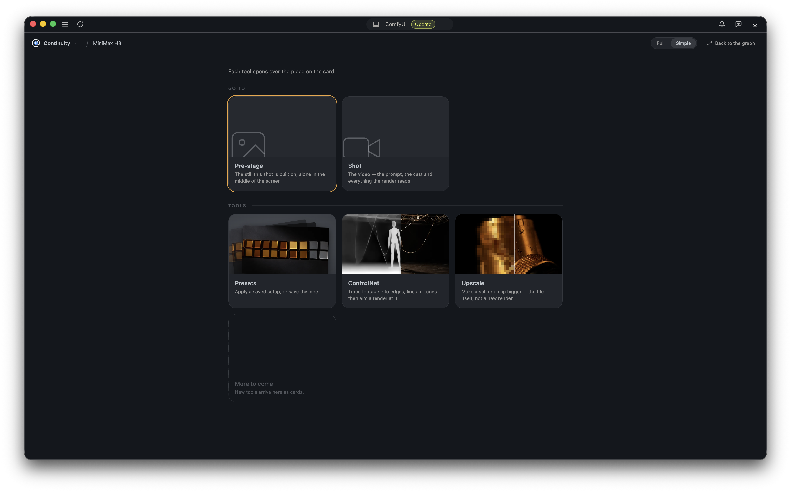

# Tools

In the fullscreen editor, press the **Continuity** wordmark at the top to open
the tools dashboard. The benches live there; the smaller tools live on the
node's rail.

**Go to** switches between the pre-stage and the shot, each opening over the
piece you already have. **Tools** opens a bench on it.

## ControlNet bench

Turns footage or a photograph you already have into a guide file a render can
follow. Drop in a clip or a picture, cut the span you want, choose a tracing,
and it writes the guide into `input/continuity/control/`. No node is added and
no workflow is touched.

The tracings:

| Tracing | What it draws | Needs |
|---|---|---|
| Edges | hard outlines (Canny) | nothing |
| Lines | a drawing that follows the form | nothing |
| Blocks | the frame flattened into fields of one colour | nothing |
| Luma | the tones with the colour taken out | nothing |
| Blur | the masses and nothing else | nothing |
| As shot | no tracing; just cuts the span or strips the soundtrack | nothing |
| Depth | a depth map (Depth Anything 3) | a model, see [models.md](models.md#the-controlnet-bench) |
| Pose | a skeleton (SDPose) | a model, see [models.md](models.md#the-controlnet-bench) |
| Matte | a white-on-black mask of a named subject (SAM 3), for video inpainting: everything outside the white stays the source clip, only the subject is regenerated. Invert it to keep the subject and replace the world. | the SAM 3 checkpoint |

The five arithmetic tracings redraw live while you drag a slider, and pressing
play traces the clip as it runs. Depth, Pose and Matte run a model per frame,
so you press **Trace** and the written file is what plays back. The preview is
one rectangle with a draggable seam: footage on the left, tracing on the
right.

**Send to pre-stage** makes the guide the still's init image; **Send to the
shot** attaches it as a reference you can cite with `@`. Neither is required;
the file is in the picker either way.

## Blockout bench

Starts from nothing at all: block a scene out of grey boxes, frame it through
the one camera there is, and render a guide along the camera's path. No model,
no download, no queue — the renderer is arithmetic in the browser, and what is
on the glass is exactly what gets written into
`input/continuity/blockout/`.

There is no second camera. The light box is the lens, and getting around the
set is operating it: drag pans and tilts, shift-drag trucks and pedestals, the
wheel pushes in and pulls out. Frame the shot and press **Mark**, frame the
next one and mark that; the clip walks the marks in order over a duration you
set. One mark (or none) writes a still instead.

Four outputs, three of them wearing the ControlNet bench's own names:

| Pass | What it writes |
|---|---|
| As staged | no tracing — the clay render itself, as footage, for the families that read a plain clip or picture as a reference or an init |
| Depth | near bright, far dark, the map Depth Anything draws — from the geometry, so nothing is guessed |
| Blocks | each piece one flat field of colour |
| Lines | the set's edges, white on black |

The floor grid and the selection ring are staging aids and never reach the
written file.

The foot narrates the camera move as you mark it — *"The camera pushes in at
slow speed."* — in the motion-type, amplitude and speed vocabulary the H3
prompt spec defines, so **Copy** hands you the move as prose to paste straight
into a prompt. The finished guide goes through the same doors a tracing does,
and the scene itself is saved as a small `.json` beside the clip.

## Upscale bench

Takes any still or clip (from this pack or not) and makes it bigger or
repairs it. Results land in `output/continuity/upscaled/`, beside your
renders, and can be attached to the shot or pre-stage from there.

Two backends:

- **Sharpen** is a GAN upscaler (anything spandrel loads) through core's own
  tiling. It resolves detail that is already in the picture and invents none:
  a face comes back the same face, and soft footage comes back soft and
  bigger, which is the honest answer for it.
- **Restore** is SeedVR2. It repairs rather than enlarges: compression
  artefacts, grain, the softness of a small frame. On a clip it reads several
  frames at once so movement doesn't boil. **Frames at a time** is the dial to
  lower if a long shot runs out of VRAM. Much slower than Sharpen, and the
  right answer for footage with something wrong with it.

The preview shows one square of the source at the size it will actually come
out, split against plain resampling, which is the comparison worth making.
**Try it here** runs the backend on that square alone, so you can dial
settings in seconds instead of re-running the whole file. On a clip, the trim
bar cuts the span first, and **This frame** takes just the frame under the
playhead as a picture.

Files for both backends: [models.md](models.md#the-upscale-bench).

## Contact sheet

On the pre-stage's rail. Lays nine frames of a clip out as one gutterless
picture, so an edit model (Qwen Image Edit or Flux 2 Klein) can be asked about
a whole shot at once and holds the subject across the tiles. The same tool
cuts the edited sheet back into nine frames in the input folder. Browser-side
arithmetic: no queue, no weights.

## Presets

**Presets** on the rail saves a setup you can put back: a whole piece, one
shot off a strip, a pre-stage, or one cast member. Applying is per-section:
tick just *look* and *speed* to drop a canvas and a step count onto a shot you
already wrote, leaving the prose alone. A preset saves the sampler row of the
family it was made on and won't push it onto another family's shot. **From a
render** turns a finished MP4 or PNG back into a preset, from the workflow the
file already carries.

## The style atlas

The library's last tab is a catalogue of **941 looks**, indexed from
[ostris/minimax_h3_1k](https://huggingface.co/datasets/ostris/minimax_h3_1k)
by [hoodtronik's Style Atlas](https://github.com/hoodtronik/minimax-h3-style-atlas),
each with the frames it was cut from. They aren't adjectives somebody thought
of; they're the exact strings the model was captioned with. Applying one swaps
the lead of your prompt rather than stacking on top, so trying six looks gives
you six prompts, not six paragraphs. The atlas is vendored (about 40 MB, most
of this repo's size) and nothing is downloaded at runtime.

## LoRA manager

A full-screen manager over `models/loras`, with cards built from whatever
sidecar metadata sits beside each file (CiviMeta, Civitai Helper,
ComfyUI-Lora-Manager formats all read). Per-LoRA strength, trigger words
prefixed at compile time and shown under the chips, versions grouped per
model, favourites, and saved stacks. Strengths you set are remembered.

Each entry names the checkpoints it claims. A LoRA that would match no keys on
the checkpoint it lands on is refused rather than quietly rendering an
unchanged video.

On MiniMax H3 each card also carries a **Soundtrack** dial. H3 generates picture
and sound together through one transformer, so an adapter conditions the audio
whether it was trained to or not — and it was: video and audio are denoised
jointly during training, so a file built from clips whose sound was silent,
scraped or absent has learned that too, and emits it under every render it is
in. The usual symptom is mumbled speech in a shot where nobody was meant to
speak. Turning the dial down damps that file's hold on the soundtrack while
leaving its hold on the picture at full strength. It damps rather than mutes:
H3 attends over video, text and audio as one sequence, so the adapter still
reaches the sound through the tower. Full is the default and what you set is
remembered per file.

## ReDetail

LTX 2.5 only: a second pass over a finished render through Lightricks' x2
IC-LoRA. It re-renders rather than resolves, inventing detail as it goes,
which is why it lives in a render's own settings and not on the upscale bench.
